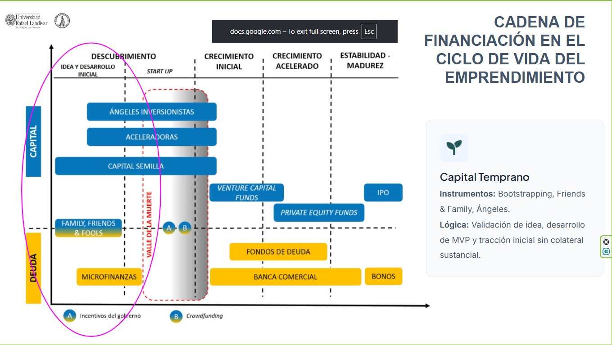
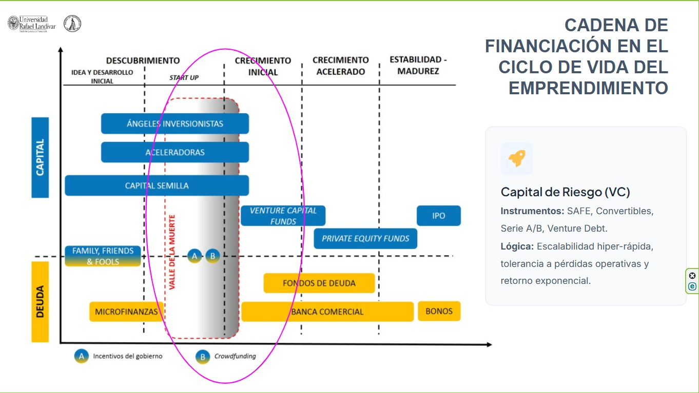
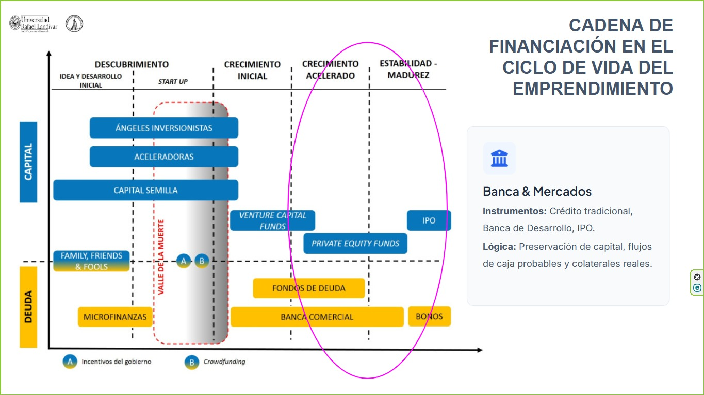

## {#inicio .cover}

```{=html}
<p class="eyebrow">COMPETENCIAS DE EMPRENDIMIENTO · GUATEMALA</p><h1>El capital sigue<br>al <em>riesgo.</em></h1><p class="subtitle">Mapeo de etapa y riesgo en tres startups</p><div class="cover-bottom"><span>Stefani Villeda<br>Paulo Garrido</span><span>Validación / Escalamiento / Repago</span></div>
<div class="presentation-resources" aria-hidden="true">
  
  
  
</div>
<style>
.presentation-resources {
  display: none !important;
}
.reference-modal {
  position: fixed;
  inset: 0;
  z-index: 99999;
  display: none;
  align-items: center;
  justify-content: center;
  padding: 2.2rem;
  background: rgba(0, 0, 0, 0.88);
}
.reference-modal.is-open {
  display: flex;
}
.reference-modal__panel {
  position: relative;
  width: min(1120px, 92vw);
  max-height: 88vh;
  padding: 1.1rem;
  border: 1px solid rgba(255,255,255,.18);
  border-radius: 14px;
  background: #111a22;
  box-shadow: 0 20px 60px rgba(0,0,0,.45);
}
.reference-modal__panel img {
  display: block;
  width: 100%;
  max-height: 76vh;
  object-fit: contain;
  border-radius: 8px;
}
.reference-modal__close {
  position: absolute;
  top: .55rem;
  right: .65rem;
  z-index: 2;
  padding: .35rem .65rem;
  border: 1px solid rgba(255,255,255,.35);
  border-radius: 7px;
  background: #17232d;
  color: #f6f3eb;
  font-size: .48em;
  font-weight: 700;
  cursor: pointer;
}
.reference-modal__caption {
  margin: .55rem .2rem 0;
  color: #c9d0d6;
  font-size: .42em;
}
</style>
```


## {#criterio .standard}

```{=html}
<p class="eyebrow">01 / CRITERIO</p><h2>¿Qué debe financiar<br>el siguiente aporte?</h2><div class="sequence"><div><span>01</span><h3>Etapa</h3><p>La evidencia disponible</p></div><div><span>02</span><h3>Riesgo</h3><p>Lo que falta demostrar</p></div><div><span>03</span><h3>Instrumento</h3><p>Las obligaciones asumidas</p></div><div><span>04</span><h3>Actor</h3><p>Quién tolera ese riesgo</p></div></div><p class="takeaway">El sector da contexto. La incertidumbre orienta la decisión.</p><p class="muted">Supuestos de nuestro análisis: MVP en Fintech, expansión en SaaS y caja previsible para financiar la expansión de AgriTech.</p>
```


## {#cadena .standard}

```{=html}
<p class="eyebrow">02 / CADENA DE FINANCIAMIENTO</p><h2>Tres lógicas de capital</h2><div class="phase-tabs" role="group" aria-label="Seleccionar fase"><button data-phase="0" aria-pressed="true">A · Validación</button><button data-phase="1" aria-pressed="false">B · Escalamiento</button><button data-phase="2" aria-pressed="false">C · Repago</button></div><div class="phase-body" aria-live="polite"><div><p class="big-letter" id="phase-letter">A</p></div><div><h3 id="phase-title">Capital temprano</h3><p id="phase-logic">El capital permite probar el MVP y conseguir tracción inicial, sin colateral sustancial.</p><p class="muted" id="phase-tools">Bootstrapping · Friends & Family · Ángeles</p><button class="text-button" id="phase-image" data-image-id="fase-img-1">Ver lámina original ↗</button></div></div>
```


## {#fintech .standard}

```{=html}
<p class="eyebrow">03 / FINTECH · REFERENCIA A</p><h2>Un MVP todavía<br>debe probar su mercado</h2><div class="decision-layout"><div class="fact"><strong>0</strong><span>ingresos reportados</span><p>MVP desarrollado.<br>Objetivo: validar adopción y pago.</p></div><div class="decision"><p class="label">INSTRUMENTO PROPUESTO</p><h3>Participación accionaria<br>en una ronda temprana</h3><p><b>Actor:</b> ángel con experiencia en Fintech.</p><p>Acepta perder el capital a cambio del potencial de valorización; puede aportar criterio comercial y sectorial.</p></div></div><p class="takeaway">El capital financia aprendizaje antes de exigir repago.</p>
```


## {#fintech-riesgos .standard}

```{=html}
<p class="eyebrow">FINTECH / DOS PERSPECTIVAS</p><h2>El riesgo dominante es<br>la validación</h2><div class="risk-columns"><div><h3>La startup asume</h3><p><b>Dilución y control</b><br>Ceder participación temprano puede limitar decisiones.</p><p><b>Caja y nuevas rondas</b><br>El dinero puede agotarse antes de validar.</p><p><b>Cumplimiento y operación</b><br>Adaptar el producto puede elevar costos.</p></div><div><h3>El financiador asume</h3><p><b>Adopción y monetización</b><br>Un MVP funcional puede no encontrar clientes.</p><p><b>Pérdida del capital</b><br>No hay flujos demostrados; no se acreditan garantías.</p><p><b>Tecnología y regulación</b><br>Fallas, seguridad o restricciones pueden frenar el modelo.</p></div></div><p class="takeaway">Hito siguiente: adopción, retención y disposición a pagar.</p>
```


## {#saas .standard}

```{=html}
<p class="eyebrow">04 / SAAS · REFERENCIA B</p><h2>Hay tracción.<br>Falta demostrar escala.</h2><div class="decision-layout"><div class="fact"><strong>US$20k</strong><span>ingreso mensual recurrente</span><p>US$240k anualizados si el MRR<br>se mantiene. No es un pronóstico.</p></div><div class="decision"><p class="label">INSTRUMENTO PROPUESTO</p><h3>SAFE</h3><p><b>Actor:</b> fondo VC de etapa temprana.</p><p>Financia expansión con conversión futura a acciones y tolera pérdidas si existe una hipótesis creíble de crecimiento.</p></div></div><p class="takeaway">El MRR es una señal; la retención y la economía unitaria la ponen a prueba.</p>
```


## {#safe .standard}
```{=html}
<p class="eyebrow">SAAS / ELECCIÓN DEL INSTRUMENTO</p>

<h2>Por qué elegimos SAFE</h2>

<p class="slide-intro">
Ambos instrumentos permiten financiar hoy a la startup y vincular al inversionista
con participación futura. La diferencia relevante en esta etapa es que la nota convertible suele incorporar vencimiento, mientras que
<strong>el SAFE estándar no</strong>.
</p>

<div class="clean-compare">

  <div class="clean-card clean-safe">
    <h3>SAFE estándar</h3>
    <p class="flow">Capital hoy para tener equity futuro</p>

    <div class="clean-row">
      <span class="row-label">Naturaleza</span>
      <span>Derecho contractual a recibir acciones en una ronda futura.</span>
    </div>

    <div class="clean-row">
      <span class="row-label">Interés y vencimiento</span>
      <span><strong>No devenga intereses</strong> y <strong>no tiene vencimiento</strong>.</span>
    </div>

    <div class="clean-row">
      <span class="row-label">Implicación</span>
      <span>El costo principal para los fundadores es la dilución futura.</span>
    </div>
  </div>

  <div class="clean-card clean-note">
    <h3>Nota convertible</h3>
    <p class="flow">Deuda hoy para posible equity futuro</p>

    <div class="clean-row">
      <span class="row-label">Naturaleza</span>
      <span>Deuda que posteriormente puede convertirse en acciones.</span>
    </div>

    <div class="clean-row">
      <span class="row-label">Interés y vencimiento</span>
      <span>Suele devengar intereses y tener una fecha de vencimiento.</span>
    </div>

    <div class="clean-row">
      <span class="row-label">Implicación</span>
      <span>A la dilución futura se añade presión financiera si el instrumento vence.</span>
    </div>
  </div>

</div>

<div class="clean-takeaway">
  <span class="takeaway-label">¿Cuál es la decisión?</span>
  <span class="takeaway-text">
    A la luz de la naturaleza de los instrumentos, elegimos <strong>SAFE</strong> porque permite financiar el crecimiento del SaaS
    sin introducir una presión de vencimiento mientras la empresa todavía debe
    demostrar que su escalamiento es repetible y sostenible.
  </span>
</div>
```


## {#saas-riesgos .standard}

```{=html}
<p class="eyebrow">SAAS / DOS PERSPECTIVAS</p><h2>El riesgo dominante es<br>la escalabilidad</h2><div class="risk-columns"><div><h3>La startup asume</h3><p><b>Dilución futura</b><br>La conversión y nuevas rondas reducen participación.</p><p><b>Crecimiento y caja</b><br>Expandirse puede elevar el consumo mensual de efectivo.</p><p><b>Dependencia de capital</b><br>Una ronda posterior puede llegar tarde o a menor valoración.</p></div><div><h3>El financiador asume</h3><p><b>Retención y concentración</b><br>El ingreso puede depender de clientes que abandonan.</p><p><b>Economía unitaria</b><br>Captar clientes puede costar más de lo que aportan.</p><p><b>Escala y salida</b><br>La empresa puede crecer menos de lo necesario para el fondo.</p></div></div><p class="takeaway">Hito siguiente: crecimiento repetible con retención y márgenes sostenibles.</p>
```


## {#agritech .standard}

```{=html}
<p class="eyebrow">05 / AGRITECH · REFERENCIA C</p><h2>La caja permite evaluar<br>una obligación de pago</h2><div class="decision-layout"><div class="fact word"><strong>Rentable</strong><span>flujos previsibles</span><p>Busca nuevos mercados<br>o nuevas líneas de producto.</p></div><div class="decision"><p class="label">INSTRUMENTO PROPUESTO</p><h3>Crédito a plazo</h3><p><b>Actor:</b> banco comercial; banca de desarrollo si cumple sus criterios.</p><p>Financia expansión preservando participación, siempre que la caja soporte intereses y amortizaciones.</p></div></div><p class="takeaway">La rentabilidad orienta; la capacidad de pago decide.</p>
```


## {#agritech-riesgos .standard}

```{=html}
<p class="eyebrow">AGRITECH / DOS PERSPECTIVAS</p><h2>El riesgo dominante es<br>el repago de la expansión</h2><div class="risk-columns"><div><h3>La startup asume</h3><p><b>Pagos obligatorios</b><br>La deuda se paga aunque la expansión se retrase.</p><p><b>Garantías y restricciones</b><br>Puede comprometer activos y aceptar límites contractuales.</p><p><b>Exposición operativa</b><br>Clima, precios o logística pueden reducir caja.</p></div><div><h3>El financiador asume</h3><p><b>Incumplimiento</b><br>La caja puede no alcanzar para capital e intereses.</p><p><b>Ejecución y concentración</b><br>Nuevos mercados o pocos compradores elevan exposición.</p><p><b>Recuperación</b><br>Las garantías pueden perder valor o ser difíciles de realizar.</p></div></div><p class="takeaway">Condición: conservar capacidad de pago en escenarios adversos.</p>
```


## {#prueba-caja .standard}

```{=html}
<p class="eyebrow">AGRITECH / EXPLORACIÓN</p><h2>¿Cuánto deterioro<br>puede absorber la caja?</h2><p class="intro">Ejemplificación del riesgo: caja disponible de US$150 mil y servicio anual de deuda de US$100 mil.</p><div class="stress-layout"><div><label for="shock">Caída de caja: <output id="shock-value">0%</output></label><input id="shock" type="range" min="0" max="60" value="0" step="5"><p class="muted">Mueve el control para explorar el margen de pago.</p><button class="text-button" id="reset-shock">Restablecer ejemplo</button></div><div class="ratio"><strong id="coverage">1.50×</strong><span>cobertura del servicio de deuda</span><p id="coverage-message" aria-live="polite">La caja excede el servicio de deuda en US$50 mil.</p></div></div>
```


## {#sintesis .standard}

```{=html}
<p class="eyebrow">06 / SÍNTESIS</p><h2>La misma regla, tres decisiones diferentes</h2><table class="summary-table"><thead><tr><th>Caso / etapa</th><th>Riesgo dominante</th><th>Instrumento</th><th>Actor</th></tr></thead><tbody><tr><td><b>Fintech</b><small>Validación · A</small></td><td>Adopción y pago</td><td>Participación accionaria</td><td>Ángel sectorial</td></tr><tr><td><b>SaaS</b><small>Escalamiento · B</small></td><td>Escala repetible</td><td>SAFE</td><td>VC temprano</td></tr><tr><td><b>AgriTech</b><small>Expansión · C</small></td><td>Repago y ejecución</td><td>Crédito a plazo</td><td>Banco</td></tr></tbody></table><p class="takeaway">Cada elección depende de evidencia adicional y de los términos del financiamiento.</p>
```


## {#decision .standard}

```{=html}
<p class="eyebrow">07 / DISCUSIÓN</p><h2>¿Mantendrías el crédito?</h2><p class="question">Supongamos un escenario adicional: la AgriTech sigue siendo rentable, pero su nueva línea tardará tres años en generar caja y el negocio actual no alcanza para pagar la deuda.</p><div class="quiz-options"><button data-answer="no">Revisaría la estructura</button><button data-answer="yes">Mantendría el crédito</button></div><div id="quiz-feedback" aria-live="polite" class="quiz-feedback">Selecciona una respuesta y defiende qué riesgo cambió.</div>
```


## {#cierre .closing}

```{=html}
<p class="eyebrow">CONCLUSIÓN</p><h2 class="closing-title">La estructura del capital<br>debe corresponder<br>al riesgo que financia.</h2><div class="closing-line"><span>Validar</span><span>Escalar</span><span>Repagar</span></div><p class="subtitle">Elegir bien exige explicar quién asume el riesgo<br>y cómo espera recuperar su dinero.</p>
```


```{=html}
<script>
(() => {
  "use strict";

  const phases = [
    {
      letter: "A",
      title: "Capital temprano",
      logic: "El capital permite probar el MVP y conseguir tracción inicial, sin colateral sustancial.",
      tools: "Bootstrapping · Friends & Family · Ángeles",
      imageId: "fase-img-1",
      caption: "Referencia A · Capital temprano"
    },
    {
      letter: "B",
      title: "Capital de riesgo (VC)",
      logic: "El capital financia el escalamiento y tolera pérdidas operativas mientras exista una hipótesis creíble de crecimiento.",
      tools: "SAFE · Notas convertibles · Serie A/B · Venture Debt",
      imageId: "fase-img-2",
      caption: "Referencia B · Capital de riesgo"
    },
    {
      letter: "C",
      title: "Banca y mercados",
      logic: "El financiamiento se apoya en flujos de caja previsibles, capacidad de repago y, cuando corresponde, colateral.",
      tools: "Crédito tradicional · Banca de Desarrollo · IPO",
      imageId: "fase-img-3",
      caption: "Referencia C · Banca y mercados"
    }
  ];

  let currentPhase = 0;

  function initPhaseTabs() {
    const buttons = document.querySelectorAll(".phase-tabs button[data-phase]");
    const letter = document.getElementById("phase-letter");
    const title = document.getElementById("phase-title");
    const logic = document.getElementById("phase-logic");
    const tools = document.getElementById("phase-tools");
    const imageButton = document.getElementById("phase-image");

    if (!buttons.length || !letter || !title || !logic || !tools || !imageButton) return;

    function setPhase(index) {
      const phase = phases[index];
      if (!phase) return;

      currentPhase = index;
      letter.textContent = phase.letter;
      title.textContent = phase.title;
      logic.textContent = phase.logic;
      tools.textContent = phase.tools;
      imageButton.dataset.imageId = phase.imageId;

      buttons.forEach((button) => {
        button.setAttribute(
          "aria-pressed",
          String(Number(button.dataset.phase) === index)
        );
      });
    }

    buttons.forEach((button) => {
      button.addEventListener("click", () => {
        setPhase(Number(button.dataset.phase));
      });
    });

    setPhase(0);
  }

  function buildModal() {
    let modal = document.getElementById("reference-modal");
    if (modal) return modal;

    modal = document.createElement("div");
    modal.id = "reference-modal";
    modal.className = "reference-modal";
    modal.setAttribute("role", "dialog");
    modal.setAttribute("aria-modal", "true");
    modal.setAttribute("aria-label", "Lámina original");

    modal.innerHTML = `
      <div class="reference-modal__panel">
        <button type="button" class="reference-modal__close" aria-label="Cerrar">Cerrar ×</button>
        
        <p class="reference-modal__caption"></p>
      </div>
    `;

    document.body.appendChild(modal);

    const close = () => modal.classList.remove("is-open");

    modal.querySelector(".reference-modal__close").addEventListener("click", close);
    modal.addEventListener("click", (event) => {
      if (event.target === modal) close();
    });

    document.addEventListener("keydown", (event) => {
      if (event.key === "Escape" && modal.classList.contains("is-open")) {
        event.preventDefault();
        event.stopPropagation();
        close();
      }
    }, true);

    return modal;
  }

  function initReferenceModal() {
    const trigger = document.getElementById("phase-image");
    if (!trigger) return;

    const modal = buildModal();
    const modalImage = modal.querySelector("img");
    const caption = modal.querySelector(".reference-modal__caption");

    trigger.addEventListener("click", (event) => {
      event.preventDefault();
      event.stopImmediatePropagation();

      const phase = phases[currentPhase];
      const embeddedImage = document.getElementById(
        trigger.dataset.imageId || phase.imageId
      );

      if (!embeddedImage || !embeddedImage.src) {
        alert("No fue posible cargar la lámina de referencia.");
        return;
      }

      modalImage.src = embeddedImage.src;
      modalImage.alt = embeddedImage.alt || phase.caption;
      caption.textContent = phase.caption;
      modal.classList.add("is-open");
    }, true);
  }

  function initStressTest() {
    const slider = document.getElementById("shock");
    const value = document.getElementById("shock-value");
    const coverage = document.getElementById("coverage");
    const message = document.getElementById("coverage-message");
    const reset = document.getElementById("reset-shock");

    if (!slider || !value || !coverage || !message) return;

    const baseCash = 150;
    const debtService = 100;

    function update() {
      const shock = Number(slider.value);
      const cash = baseCash * (1 - shock / 100);
      const ratio = cash / debtService;
      const difference = cash - debtService;

      value.textContent = `${shock}%`;
      coverage.textContent = `${ratio.toFixed(2)}×`;

      if (difference > 0.001) {
        message.textContent =
          `La caja excede el servicio de deuda en US$${difference.toFixed(0)} mil.`;
      } else if (Math.abs(difference) <= 0.001) {
        message.textContent =
          "La caja cubre exactamente el servicio anual de deuda.";
      } else {
        message.textContent =
          `La caja sería insuficiente en US$${Math.abs(difference).toFixed(0)} mil.`;
      }
    }

    slider.addEventListener("input", update);

    if (reset) {
      reset.addEventListener("click", () => {
        slider.value = 0;
        update();
      });
    }

    update();
  }

  function initQuiz() {
    const options = document.querySelectorAll(".quiz-options button[data-answer]");
    const feedback = document.getElementById("quiz-feedback");
    if (!options.length || !feedback) return;

    options.forEach((button) => {
      button.addEventListener("click", () => {
        const revise = button.dataset.answer === "no";

        options.forEach((item) => {
          item.setAttribute(
            "aria-pressed",
            String(item === button)
          );
        });

        if (revise) {
          feedback.textContent =
            "Revisaría la estructura: el proyecto deja de generar caja a tiempo para atender la deuda, por lo que cambió el riesgo de repago.";
        } else {
          feedback.textContent =
            "Mantener el crédito exigiría justificar cómo se cubrirán los pagos durante los tres años sin caja de la nueva línea.";
        }
      });
    });
  }

  function init() {
    initPhaseTabs();
    initReferenceModal();
    initStressTest();
    initQuiz();
  }

  if (document.readyState === "loading") {
    document.addEventListener("DOMContentLoaded", init, { once: true });
  } else {
    init();
  }
})();
</script>
```

